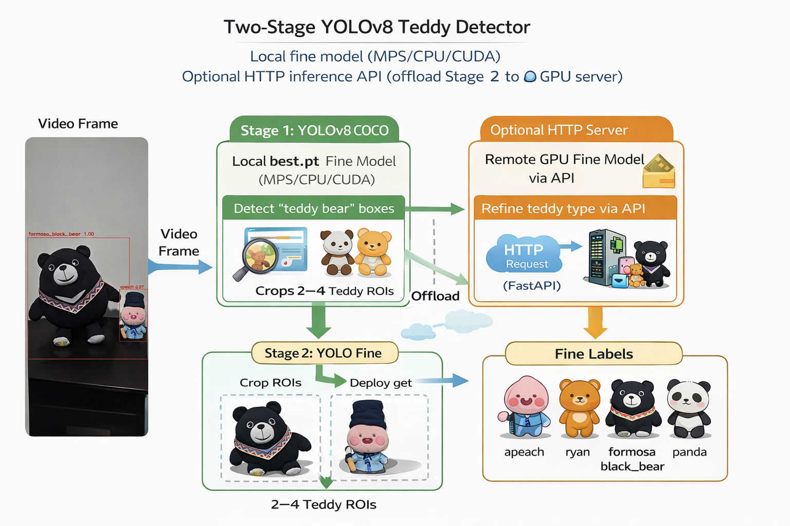

# Teddy Cascade YOLOv8

A two-stage YOLOv8 pipeline for fine-grained teddy bear recognition in video.

The system works as a **cascade detector**:

1. **Stage 1 (YOLOv8 COCO)**  
   Detects `teddy bear` objects in video frames.

2. **Stage 2 (Custom YOLOv8 model)**  
   Classifies each teddy ROI into specific types:
   - `apeach`
   - `formosa_black_bear`
   - `panda`
   - `ryan`

Stage 2 can run either:

- locally on the same machine
- as an **HTTP inference API** (FastAPI)
- on a **remote GPU server** (e.g. RTX 4000 Ada)

This architecture allows inexpensive local processing while optionally offloading heavy inference to a GPU server.

---

# Architecture

